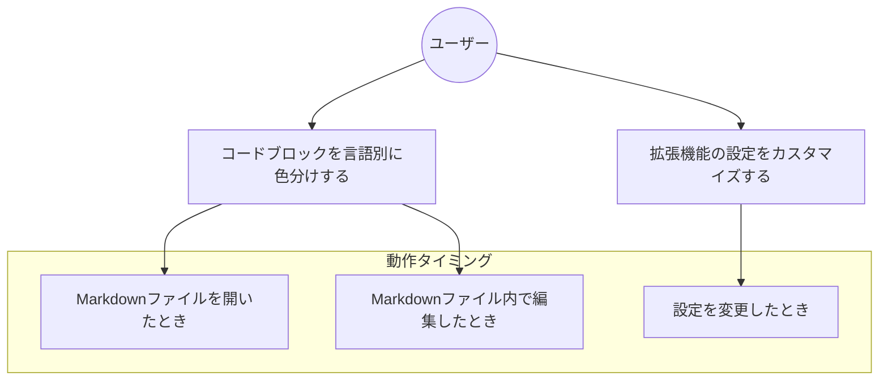
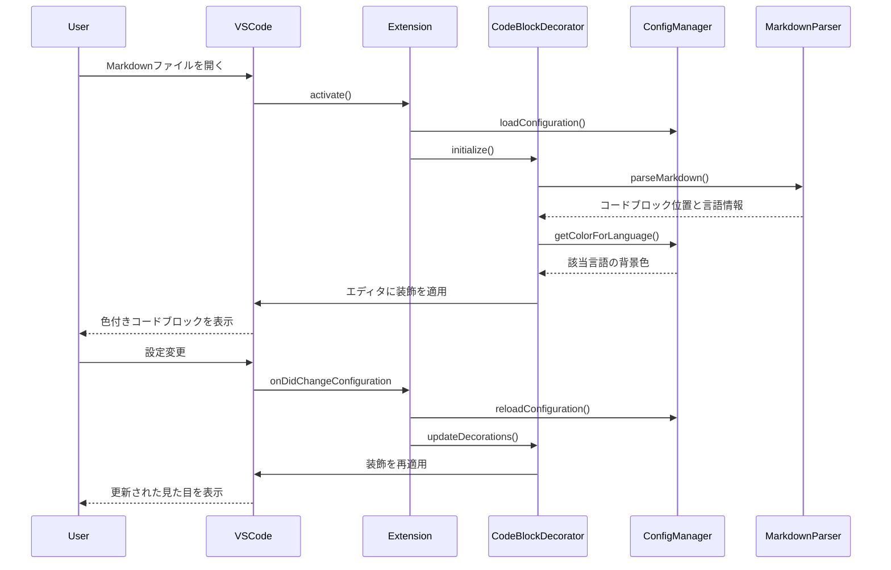
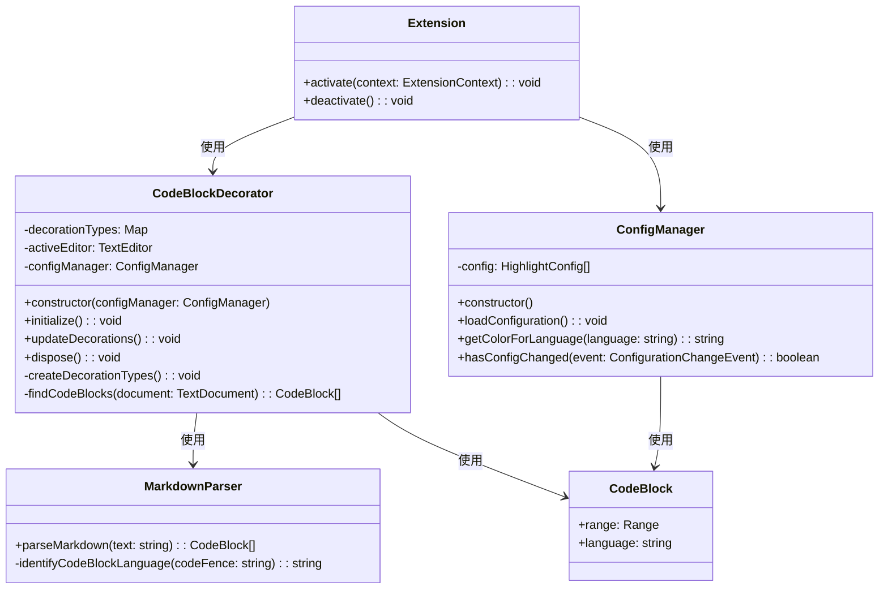

# Issue-1081 仕様書

## 1. 目次
- [1. 目次](#1-目次)
- [2. 用語](#2-用語)
- [3. 依頼内容](#3-依頼内容)
- [4. 機能要件/非機能要件](#4-機能要件非機能要件)
  - [4.1. 機能要件](#41-機能要件)
  - [4.2. 非機能要件](#42-非機能要件)
- [5. 使用ツール/ライブラリ](#5-使用ツールライブラリ)
- [6. UML](#6-uml)
  - [6.1. ユースケース図](#61-ユースケース図)
  - [6.2. フォルダ構成](#62-フォルダ構成)
  - [6.3. シーケンス図](#63-シーケンス図)
  - [6.4. クラス図](#64-クラス図)
- [7. クラス詳細](#7-クラス詳細)
- [8. タスク](#8-タスク)

## 2. 用語
- **コードブロック**: Markdownファイル内の「```」で囲まれたコード部分
- **言語識別子**: コードブロック開始時に指定される言語（例: ```python, ```js）

## 3. 依頼内容
- issue番号: 1081
- タイトル: Markdownファイルのコードブロック内の背景色を変える
- 内容: 
  - Markdownファイル内の```で囲まれたコードブロック内の背景のみ任意の色に変更する
  - 設定では、background colorを指定でき、色を変更可能
  - languagesには|パイプ区切りで複数選択可能(例: py|python|Python)

## 4. 機能要件/非機能要件
### 4.1. 機能要件
- Markdownファイル内のコードブロックの背景色を設定できること
- コードブロックの言語ごとに異なる背景色を設定できること
- 複数の言語識別子を一つの設定にマッピングできること（例: py, python, Pythonを同じ色に）
- 言語が指定されていないコードブロックに対するデフォルト色を設定できること

### 4.2. 非機能要件
- エディタの描画パフォーマンスに影響を与えないこと
- 他の拡張機能やVS Codeテーマとの競合を最小限にすること

## 5. 使用ツール/ライブラリ
- VSCode Extension API
- TypeScript

## 6. UML
### 6.1. ユースケース図


### 6.2. フォルダ構成
```plaintext
codeblock-highlight/
├── src/
│   ├── extension.ts         # 拡張機能のエントリーポイント
│   ├── codeBlockDecorator.ts # コードブロック装飾管理クラス
│   ├── configManager.ts     # 設定管理クラス
│   ├── markdownParser.ts    # Markdownパーサークラス
│   └── test/              
│       └── extension.test.ts # テストファイル
```

### 6.3. シーケンス図


### 6.4. クラス図


## 7. クラス詳細

### 7.1. `CodeBlockDecorator`クラス
#### 格納場所
- `src/codeBlockDecorator.ts`
#### メソッド
- `initialize(): void`
  - 説明: エディタのイベントリスナーを初期化し、最初の装飾を適用
- `updateDecorations(): void`
  - 説明: 現在のエディタに装飾を再適用
- `dispose(): void`
  - 説明: リソースの解放処理
#### メンバ
- `decorationTypes: Map<string, TextEditorDecorationType>`
  - 説明: 言語ごとの装飾タイプを保持する
- `activeEditor: TextEditor`
  - 説明: 現在アクティブなエディタの参照

### 7.2. `ConfigManager`クラス
#### 格納場所
- `src/configManager.ts`
#### メソッド
- `loadConfiguration(): void`
  - 説明: VS Codeの設定から拡張機能の設定を読み込む
- `getColorForLanguage(language: string): string`
  - 説明: 指定された言語の背景色を取得する
- `hasConfigChanged(event: ConfigurationChangeEvent): boolean`
  - 説明: 関連する設定が変更されたかを確認する
#### メンバ
- `config: HighlightConfig[]`
  - 説明: 言語と背景色のマッピング設定を保持する

### 7.3. `MarkdownParser`クラス
#### 格納場所
- `src/markdownParser.ts`
#### メソッド
- `parseMarkdown(text: string): CodeBlock[]`
  - 説明: Markdownテキストからコードブロックを抽出する
- `identifyCodeBlockLanguage(codeFence: string): string`
  - 説明: コードブロックの開始行から言語識別子を抽出する

## 8. タスク
- 合計工数: 7h
- [ ] 設定機能の実装 (2h)
  - [ ] ConfigManagerクラスの実装 (1h)
    - VS Code設定からハイライト設定を読み込む
    - 言語識別子マッチング機能の実装
  - [ ] package.jsonに設定項目を追加 (1h)
    - contributes.configuration セクションの実装
    - デフォルト設定の定義
- [ ] Markdownパース機能の実装 (2h)
  - [ ] MarkdownParserクラスの実装 (1.5h)
    - 正規表現によるコードブロック抽出
    - 言語識別子の解析
  - [ ] CodeBlockインターフェースの定義 (0.5h)
    - 範囲と言語情報を持つインターフェース設計
- [ ] エディタ装飾機能の実装 (2.5h)
  - [ ] CodeBlockDecoratorクラスの実装 (2h)
    - エディタへの装飾適用
    - イベントリスナーの設定
  - [ ] 拡張機能のアクティベーション処理 (0.5h)
    - エディタイベント登録
    - 初期化処理
- [ ] テストとデバッグ (0.5h)
  - [ ] テストケースの実装 (0.5h)
    - 各クラスの機能テスト
    - 統合テスト
