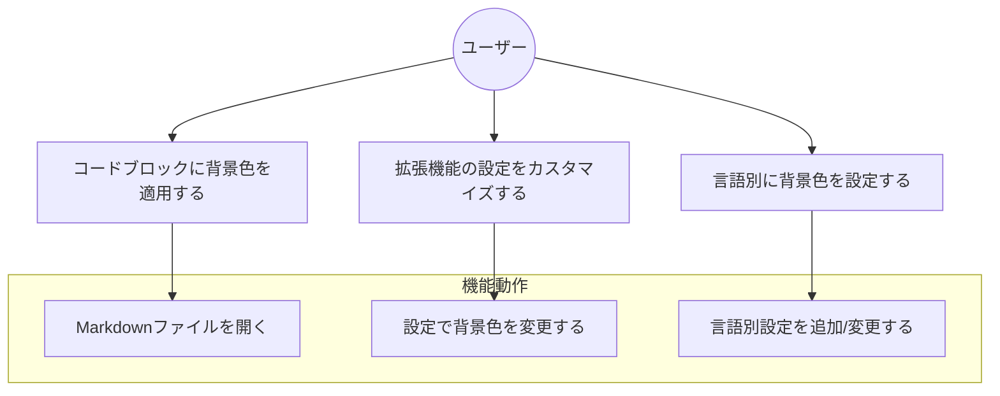
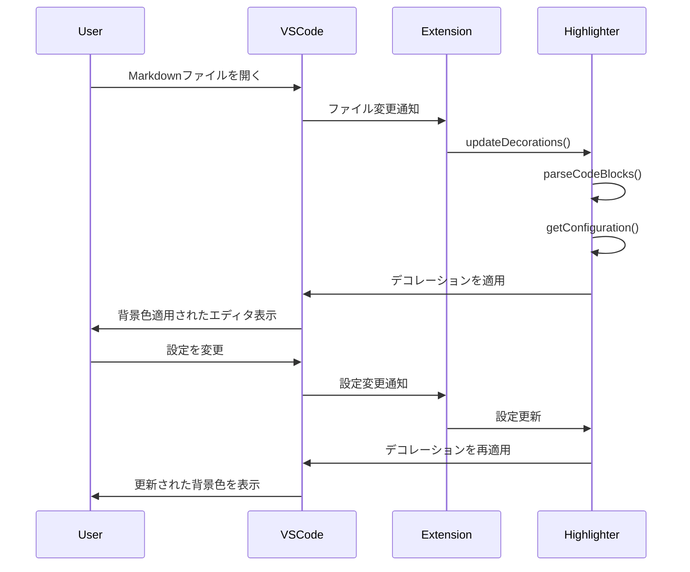
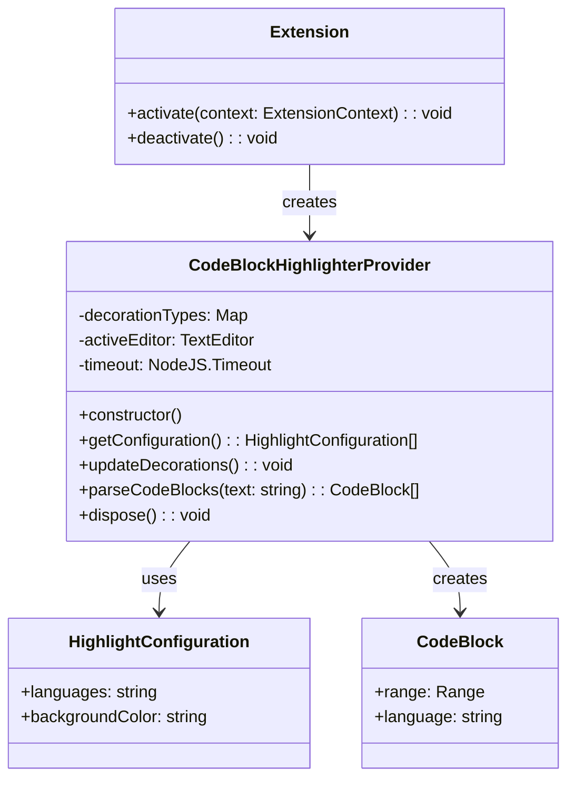

# Issue-1081の仕様書

## 1. 目次
- [1. 目次](#1-目次)
- [2. 用語](#2-用語)
- [3. 依頼内容](#3-依頼内容)
- [4. 機能要件/非機能要件](#4-機能要件非機能要件)
  - [4.1. 機能要件](#41-機能要件)
  - [4.2. 非機能要件](#42-非機能要件)
- [5. 使用ツール/ライブラリ](#5-使用ツールライブラリ)
- [6. クラス設計](#6-クラス設計)
  - [6.1. `CodeBlockHighlighterProvider`クラス(新規)](#61-codeblockHighlighterproviderクラス新規)
- [7. UML](#7-uml)
  - [ユースケース図](#ユースケース図)
  - [フォルダ構成](#フォルダ構成)
  - [7.1. シーケンス図](#71-シーケンス図)
  - [7.2. クラス図](#72-クラス図)
- [8. タスク](#8-タスク)

## 2. 用語
- コードブロック: Markdownファイル内で```で囲まれたコード部分
- デコレーション: VSCodeでテキストエディタ内のテキストに装飾を適用する機能
- TextEditorDecorationType: VSCodeのAPIで、エディタに装飾を適用するための型

## 3. 依頼内容
- issue番号: 1081
- タイトル: VS Code拡張機能 - Markdownファイルのコードブロック背景色変更
- 内容: 
  - Markdownファイル内のコードブロック(`````で囲まれた部分)の背景色を指定した色に変更する拡張機能
  - 設定で背景色を指定可能
  - 言語ごとに異なる背景色を設定可能
  - 言語指定はパイプ区切り(|)で複数選択可能 (例: py|python|Python)
  - デフォルト色の設定も可能（言語が指定されていない場合に使用）

## 4. 機能要件/非機能要件
### 4.1. 機能要件
- Markdownファイルのコードブロックを検出できること
- コードブロックの言語識別子を解析できること
- 設定ファイルから言語別の背景色設定を読み込めること
- 言語ごとに背景色を適用できること
- 設定で指定した色をリアルタイムで反映できること
- 複数の言語識別子（パイプ区切り）に対応できること
- 言語指定のない場合はデフォルト色を適用できること

### 4.2. 非機能要件
- 背景色の適用はエディタのパフォーマンスに影響を与えないこと
- ユーザーの設定変更がリアルタイムで反映されること
- 大きなMarkdownファイルでも遅延なく動作すること

## 5. 使用ツール/ライブラリ
- VS Code API (vscode)
- TypeScript

## 6. クラス設計
### 6.1. `CodeBlockHighlighterProvider`クラス(新規)
#### 格納場所
- `src/codeBlockHighlighter.ts`

#### メンバ: 
- `decorationTypes: Map<string, vscode.TextEditorDecorationType>`
  - 説明: 言語IDと対応するデコレーションタイプのマップ
- `activeEditor: vscode.TextEditor | undefined`
  - 説明: 現在アクティブなエディタ
- `timeout: NodeJS.Timeout | undefined`
  - 説明: デコレーション更新のためのタイマー

#### メソッド:
- `getConfiguration(): HighlightConfiguration[]`
  - 説明: 
    - 設定から言語ごとの背景色設定を読み込む
    - 戻り値: 言語と背景色のマッピング配列
- `updateDecorations(): void`
  - 説明: 
    - アクティブなエディタのコードブロックに装飾を適用する
    - コードブロックを検出し、言語に基づいて適切な背景色を適用
- `parseCodeBlocks(text: string): CodeBlock[]`
  - 説明:
    - 文書内のコードブロックを検出し解析する
    - 戻り値: コードブロック情報の配列
- `dispose(): void`
  - 説明:
    - 登録したデコレーションタイプを破棄する

#### インターフェース:
- `HighlightConfiguration`インターフェース
  - `languages: string` - 言語指定（パイプ区切り）
  - `backgroundColor: string` - 背景色のカラーコード
- `CodeBlock`インターフェース
  - `range: vscode.Range` - コードブロックの範囲
  - `language: string` - コードブロックの言語

#### テストケース
- 正常系:
  - `parseCodeBlocks`メソッドのテスト
    - 入力: コードブロックを含むMarkdownテキスト
    - 期待値: 正確な位置情報と言語情報を持つCodeBlock配列
  - 設定の読み込みテスト
    - 入力: 様々な言語設定
    - 期待値: 正しく解析された設定オブジェクト
- 異常系:
  - 不正な言語指定のテスト
    - 入力: 無効な言語設定
    - 期待値: エラーなく処理されること
  - 無効な色コードのテスト
    - 入力: 不正な色形式
    - 期待値: デフォルト色が使用されること

## 7. UML
### ユースケース図


### フォルダ構成
```plaintext
codeblock-highlight
├── src
│   ├── extension.ts
│   ├── codeBlockHighlighter.ts
│   └── test
│       └── extension.test.ts
├── package.json
└── README.md
```

### 7.1. シーケンス図


### 7.2. クラス図


## 8. タスク
- 合計工数: 5h
- [ ] プロジェクト構成と設定の実装 (1h)
  - [ ] package.jsonの設定追加 (0.5h)
    - contributes.configurationの追加
    - 設定スキーマの定義
  - [ ] 基本的なフォルダ構造の作成 (0.5h)
    - 必要なファイルの作成
- [ ] コードブロック解析機能の実装 (2h)
  - [ ] CodeBlockHighlighterProviderクラスの実装 (1h)
    - クラス構造の実装
    - インターフェース定義
  - [ ] コードブロック解析ロジックの実装 (1h)
    - 正規表現によるコードブロック検出
    - 言語識別子の解析
- [ ] 装飾適用機能の実装 (1.5h)
  - [ ] 設定読み込み機能の実装 (0.5h)
    - 設定ファイルからの読み込み
    - 言語マッピング処理
  - [ ] デコレーション適用ロジックの実装 (1h)
    - エディタへの装飾適用
    - 変更監視と再適用
- [ ] テストとデバッグ (0.5h)
  - [ ] 単体テストの実装 (0.5h)
    - コードブロック解析のテスト
    - 設定読み込みのテスト
